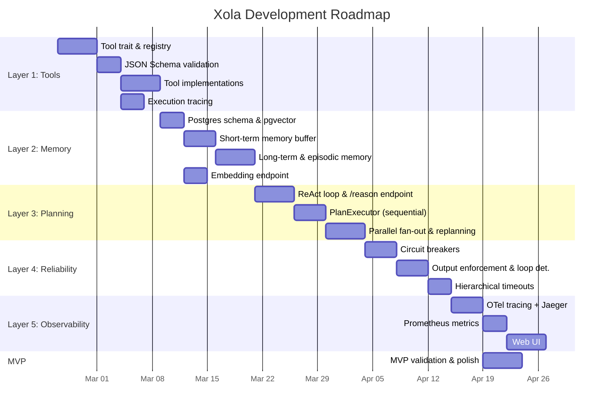

# Roadmap

This document defines the phased development plan for Xola. Each phase maps to an architectural layer and builds directly on the previous one — you are never blocked waiting for a future layer.

**Target timeline:** 8–10 weeks at intermediate Go/Rust level.

---

## Phase Overview

---

## Phase 1 — Tool Registry & Execution Sandbox

**Duration:** ~2 weeks · **Layer:** 1 · **Primary owner:** `RUNTIME_AGENT`

### Milestone: Tools are registered, validated, executed, and traced

| Deliverable | Task IDs | Notes |
|-------------|----------|-------|
| `Tool` trait with `execute(&self, input: Value) -> Result<Value>` | L1-01 | Foundation for everything |
| `ToolRegistry` as `HashMap<String, Arc<dyn Tool>>` | L1-02 | Runtime-queryable catalog |
| JSON Schema validation on all tool inputs | L1-03 | Reject bad input before execution |
| Per-tool `tokio::time::timeout` with config | L1-04 | Nothing blocks forever |
| `UrlFetchTool` — fetch and return page text | L1-05 | Uses `reqwest` |
| `WebSearchTool` — Serper or Brave API | L1-06 | External API integration |
| `CodeExecTool` — Docker-sandboxed code runner | L1-07 | Go Docker SDK, container isolation |
| Execution traces with inputs, outputs, latency, errors | L1-08 | Every tool call is observable |
| Integration tests for all three tools | L1-09 | End-to-end validation |

**What you'll learn:** Interface design, JSON Schema validation, context propagation, subprocess & container sandboxing, structured concurrency.

### Exit Criteria

- [ ] Three tools registered and callable through the registry
- [ ] Invalid inputs rejected before execution
- [ ] Every tool call respects its configured timeout
- [ ] Tool calls produce structured trace records

---

## Phase 2 — Memory Architecture

**Duration:** ~2 weeks · **Layer:** 2 · **Primary owners:** `RUNTIME_AGENT`, `LLM_SURFACE_AGENT`, `INTEGRATION_AGENT`

### Milestone: Agent maintains context across turns and recalls past experiences

| Deliverable | Task IDs | Notes |
|-------------|----------|-------|
| Postgres schema for `memories` and `episodes` tables | L2-01 | Migration-based, additive only |
| `pgvector` extension with embedding column | L2-02 | Semantic similarity search |
| `ShortTermMemory` circular buffer with token budget | L2-03 | Evicts oldest when full |
| `LongTermMemory` with semantic write/query | L2-04 | pgvector cosine similarity |
| `EpisodicLog` for structured task completion records | L2-05 | What was tried, what worked |
| `/embed` endpoint in Python | L2-06 | Returns vector + token count |
| `tiktoken` budget helper | L2-07 | Accurate token counting |
| Summarization fallback when buffer fills | L2-08 | Compression via LLM |
| Integration test: store and retrieve by similarity | L2-09 | Proves the pipeline works |

**What you'll learn:** Embedding models, vector similarity search, token counting, summarization as compression, when to read vs write memory.

### Exit Criteria

- [ ] Short-term memory respects token budget with eviction
- [ ] Long-term memory stores and retrieves by semantic similarity
- [ ] Episodic log records task outcomes
- [ ] Summarization fires when buffer exceeds limit

---

## Phase 3 — Task Planning & Orchestration

**Duration:** ~2 weeks · **Layer:** 3 · **Primary owners:** `RUNTIME_AGENT`, `LLM_SURFACE_AGENT`

### Milestone: Agent autonomously plans, executes, and replans multi-step tasks

| Deliverable | Task IDs | Notes |
|-------------|----------|-------|
| `/reason` endpoint in Python | L3-01 | Core LLM reasoning call |
| ReAct loop parser (Thought → Action → Observation) | L3-02 | Structured output extraction |
| `PlanExecutor` — sequential step runner | L3-03 | Foundation for orchestration |
| Parallel branch support via `JoinSet` fan-out | L3-04 | Independent subtasks run concurrently |
| Replan trigger on tool failure | L3-05 | Agent revises plan instead of crashing |
| Max replanning attempts with escalation | L3-06 | Prevents infinite retry loops |
| Integration test: multi-step research task | L3-07 | End-to-end autonomous task |

**What you'll learn:** The ReAct pattern, DAG-based task execution, fan-out/fan-in with goroutines and `errgroup`, stateful execution loops.

### Exit Criteria

- [ ] Agent completes multi-step tasks without human intervention
- [ ] Failed tool calls trigger replanning (not crashes)
- [ ] Independent subtasks execute in parallel
- [ ] Replanning is bounded by a configurable maximum

---

## Phase 4 — Reliability & Fault Tolerance

**Duration:** ~1.5 weeks · **Layer:** 4 · **Primary owners:** `RUNTIME_AGENT`, `LLM_SURFACE_AGENT`

### Milestone: Runtime handles all common agent failure modes gracefully

| Deliverable | Task IDs | Notes |
|-------------|----------|-------|
| `CircuitBreaker` FSM (Closed → Open → HalfOpen) | L4-01 | Atomic state transitions |
| Circuit breaker wired per-tool in registry | L4-02 | Prevents cascading failures |
| `/parse` endpoint for output validation | L4-03 | Pydantic schema enforcement |
| Corrective re-prompt on parse failure (N retries) | L4-04 | Self-healing output |
| `LoopDetector` — sliding window cycle detection | L4-05 | Aborts repetitive tool calls |
| Hierarchical timeouts (tool < step < task) | L4-06 | `CancellationToken` tree |
| Failure taxonomy (timeout / parse / tool / loop) | L4-07 | Classified error handling |
| Integration test: inject failure, verify recovery | L4-08 | Proves resilience |

**What you'll learn:** Circuit breaker pattern, defensive LLM output parsing, timeout hierarchies with context, failure taxonomies in agentic systems.

### Exit Criteria

- [ ] Circuit breakers open after repeated tool failures
- [ ] Malformed LLM output triggers corrective re-prompt
- [ ] Cyclic tool call patterns are detected and aborted
- [ ] Timeout hierarchy enforces global task deadlines

---

## Phase 5 — Observability & Runtime Introspection

**Duration:** ~1.5 weeks · **Layer:** 5 · **Primary owners:** `RUNTIME_AGENT`, `INTEGRATION_AGENT`

### Milestone: Every agent run is fully traceable, metered, and inspectable

| Deliverable | Task IDs | Notes |
|-------------|----------|-------|
| `tracing` spans on tool dispatch, memory, plan steps | L5-01 | Foundation for observability |
| OTel OTLP exporter → Jaeger | L5-02 | Distributed trace visualization |
| Prometheus metrics (success rate, plan steps, token spend) | L5-03 | Operational dashboards |
| Cost accounting (tokens × model price per LLM span) | L5-04 | Financial visibility |
| axum SSR web UI (run list, step inspector, memory browser) | L5-05 | Real-time introspection |
| Jaeger in Docker Compose | L5-06 | Local dev trace viewer |
| Integration test: assert trace contains expected spans | L5-07 | Validates instrumentation |

**What you'll learn:** OpenTelemetry in Go, structured logging vs tracing, building introspectable systems, cost accounting for LLM calls.

### Exit Criteria

- [ ] Every run produces a complete trace visible in Jaeger
- [ ] Prometheus exposes tool success rate, planning steps, token spend
- [ ] Web UI shows live agent runs with step-by-step inspection
- [ ] Cost per run is tracked and attributable

---

## MVP Checkpoint

The MVP is reached when Phase 1–3 are complete plus the tracing from Phase 5 (L5-01, L5-02, L5-06). See [MVP Definition](mvp-definition.md) for full acceptance criteria.

**MVP does not require:**
- Web UI (Phase 5 stretch goal)
- Prometheus metrics (nice to have)
- Phase 4 reliability features (improves quality but not required for demo)

**MVP does require:**
- Three working tools
- Short-term + long-term memory
- ReAct loop with replanning
- Context-based timeouts
- Jaeger traces for every run
- Clean CLI interface
